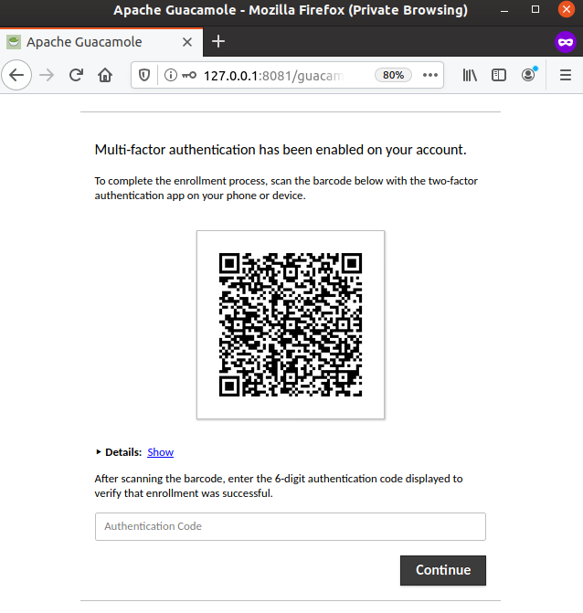
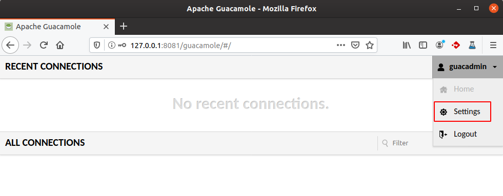
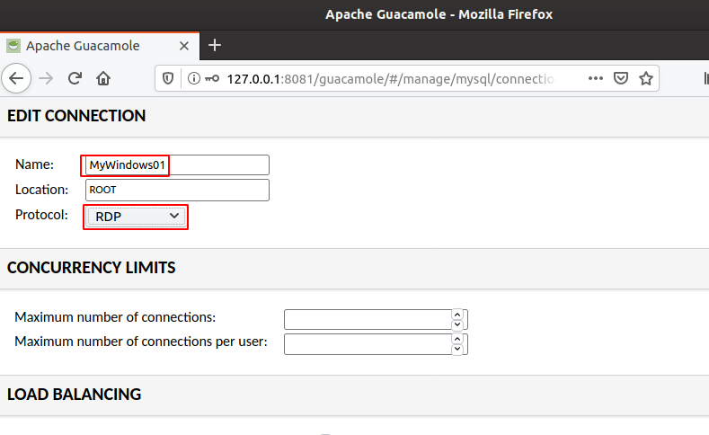
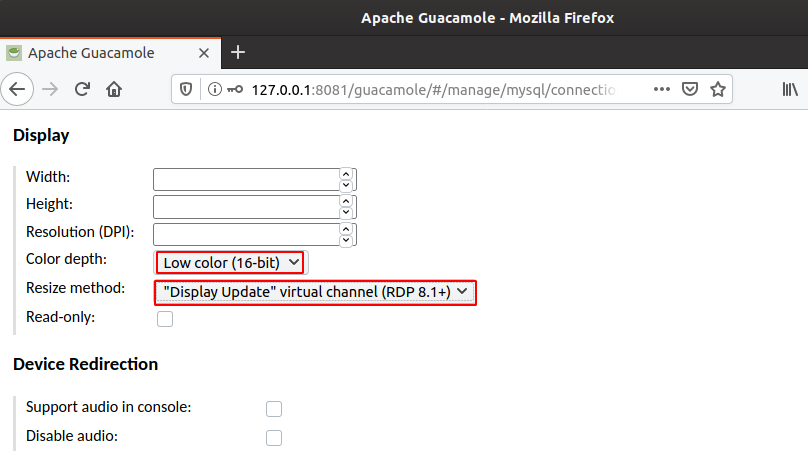
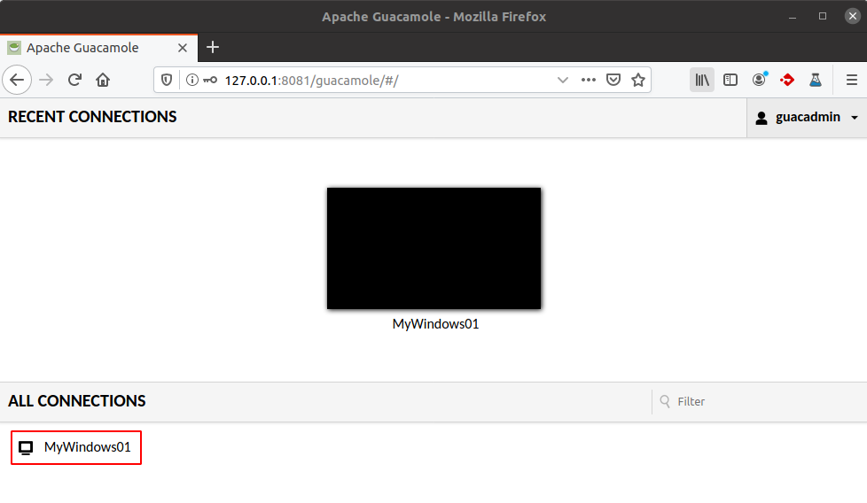
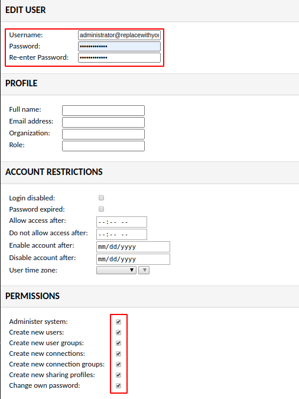
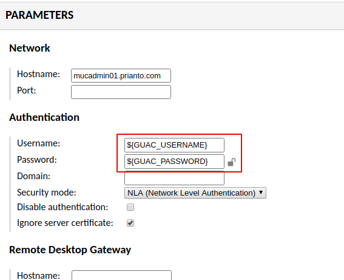

# WorkFromHome-with-Docker

*"Navigate in any webbrowser to https://desktops.yourcompany.com and logon with your corporate Active Directory account (including 2-FA) to access your Windows desktops"*  

If you want your users to be able to access for example Windows PCs or Windows RDS, which are located on your corporate network from anywhere in the world using any HTML5 capable webbrowser, then this is right for.   
If your are a homelab enthusiast and want your homelab to be accessible from any where from any device using HTML5, then this maybe worth to have a look.


This repo runs a bunch of docker containers on any Linux operating system to make this possible. 

[Traefik](https://github.com/containous/traefik/) is used as a reverse proxy, which responsible for automatically requesting and renewing a Letsencrypt certificate for SSL terminiation and securing the network traffic. HTTPS request are proxied into Apache Guacamole.

[Apache Guacamole](https://guacamole.apache.org) is a clientless remote desktop gateway, which supports protocols like RDP, VNC and SSH. Because the Guacamole client is an HTML5 web application, use of your computers is not tied to any one device or location. As long as you have access to a web browser, you have access to your machines.

This repo automates the whole configuration and integration of Traefik and Apache Guacamole. By setting a few mandatory environment variables, user authentication can be integrated into Active Directory using LDAP. Also 2-FA-Authentication is enabled using Google-Authenticator or any compatible TOTP implementation.   

If you are not afraid of Linux, Docker and a bunch of Opensource Tools, then you are there **in a few minutes**.


## How to use this repo

### Pre-requesites

Ideally you have a vanilla or an existing Ubuntu server on your corporate network. 
Your internet router should forward all network traffic, incomming from the internet on port `80` and `443` to the internal IP address and port 80 and 443 of your Ubuntu server. Port 80 is used by Letsencrypt for httpChallenge for automatic SSL certificate request an renewals. Port 443 is actually used by the secured HTTPS traffic.
You should register a public DNS hostname - for example `desktops.yourcompany.com` - which points to the external IP address your internet router. 
If your external IP address of your internet router is not a static one, but changes sometimes, then dynamic DNS updates is your friend, which is often an already built-in feature of your internet router and works usually very reliable.  
NOTE: You can easily set your DynDNS-Name as CNAME to `desktops.yourcompany.com` in your public DNS. 


### Step 1:

Run the [install.sh](install.sh) script as root on your Ubuntu server. 
This script automatically installs docker, docker-compose and git. It also clones this repo into the directoy `/srv/workfromhome-with-docker` on your server.

```console
sudo -s
curl -sfL https://raw.githubusercontent.com/andif888/workfromhome-with-docker/master/install.sh | sh -
```

### Step 2:

Edit the [.env](.env) file and customize at least the values of the mandatory environment variables with your preferred text editor. All mandatory an optional setting are documented inside the .env file.

```console
cd /srv/workfromhome-with-docker
nano .env 
```

### Step 3:

Start docker container using the [start.sh](start.sh) script.

```console
./start.sh
```

### Step 4:

Point your preferred webbrowser to the DNS host name, which you have configured as `FQDN_HOST_NAME` in your .env file. 
Example: [https://desktops.yourdomain.com](https://desktops.yourdomain.com)  
The default username is `guacadmin` and password is `guacadmin`. 

(If you currently can not access your external `FQDN_HOST_NAME` from internally, you can verify it from internally using http://ubuntu-internal-ip:8081/guacamole   
Alternatively add a hosts file entry, which points your `FQDN_HOST_NAME` to the internal IP of your Ubuntu Server -> [Beginner-Guide-to-edit-your-hosts-file](https://www.howtogeek.com/howto/27350/beginner-geek-how-to-edit-your-hosts-file/)) 

After entering credentials your prompted to scan the QR-Code, with a compatible TOTP App on your mobile phone.   
[**Google Authenticator**](https://play.google.com/store/apps/details?id=com.google.android.apps.authenticator2&hl=en) works good.



After scanning the QR-Code and entering the first token your are successfully logged into Apache Guacamole.  
**Please change the default password immediatelly**.


## Configure your first Windows Machine accessible through Guacamole, which has RDP enabled

Click `Settings` in the top right menu. 




Click `Connections` and the `New Connection` 


Enter any Name. It's only a display name. 
Select `RDP` as Protocol. 




Scroll down to `Parameters` and enter the RDP connection details.


Optionally fine-tune for latest RDP-Protocol version. 
And finally hit `Save` at the bottom of the page.




Go back to `Home` 


And start the connection



and have fun! HTML5 based RDP into your Windows machine.

 


General Help on [How to configure connections in Guacamole](https://guacamole.apache.org/doc/gug/configuring-guacamole.html#connection-configuration)


## Using Active Directory Authentication and enable 2-FA 

Make sure you have entered correct mandatory values regarding LDAP authentication into the [.env](.env) file in **Step 2** during initial configuration.   
NOTE: We don't use the AD Schema preparation documented at https://guacamole.apache.org/doc/gug/ldap-auth.html, because we don't like to edit changes in our AD Schema. 
Please read the documention to understand the mapping between database users und AD users.

### Step 1: Create an initial admin user in Guacamole which maps to an AD user 

Create a new user in Guacamole and set its username to the username of an existing AD user, which is located in your AD-Tree below the OU (Organizational Unit), which you have configured in `LDAP_USER_BASE_DN` environment variable.

If you haven't changed `LDAP_USERNAME_ATTRIBUTE` then the mapped username of your AD user is the `userPrincipalName` AD-Attribute.
Your can set any password. It **must not** match your AD user's password.
Make sure you check all permissions and hit `Save` at the bottom of the page.

 


### Step 2: Logon with your newly mapped AD user account

Now you should be able to logon with the AD user account.   
Because of we have previously set the permission `Change own password`, we are prompted with the already familiar 2-FA screen. Again use your Google Authenticator to scan the QR-Code. 

If you now navigate to `Settings -> Users` you should get already a list of  your AD user accounts, which means, your LDAP integration and authentication is working perfect.

### Step 3: Enable 2-FA for and AD user
 
 If you want to enable 2-FA for AD user then you minimum need to assign the permission `Change own password` on his user account.  
 Don't be afraid of the setting, it doesn't mean a user can change its AD password using this web GUI. It's only about changing its personal credential information in Guacamole's MySQL database, which is necessary to write down the TOTP secret key.


## The best thing at the Bottom: Pass-Through credentials to a connection 

You have already learned to create your first connection to a Windows machine further above.  
There is a nice feature which allows you to pass-through your Guacamole logon credentials to a connection.   

You remember when you have scrolled down to `Parameters` and entered the RDP connection details?  
To enable Pass-Through credentials you do not hardcode username and password. You only need to enter **parameter tokens**. 

For the username you enter `${GUAC_USERNAME}`   
For the password you enter `${GUAC_PASSWORD}` 

If you use the `userPrincipalName` for your AD users all is perfect and no need to worry about the Domain field ;-)

 

To learn more about [parameter tokens](https://guacamole.apache.org/doc/gug/configuring-guacamole.html#connection-configuration) 

 
# Troubleshooting and Logs

Viewing Traefik Logs
```console
cd /srv/workfromhome-with-docker
docker-compose logs -f --tail=1000 traefik
```

Viewing Guacamole Logs
```console
cd /srv/workfromhome-with-docker
docker-compose logs -f --tail=1000 guacamole
```

Viewing all Logs
```console
cd /srv/workfromhome-with-docker
docker-compose logs -f --tail=1000 
```

   
# References and documentation

[Guacamole User Guide](https://guacamole.apache.org/doc/gug/users-guide.html)  
[Traefik Documentation](https://docs.traefik.io)


# Disclaimer 

Use at your own risk.  
This is not a solution which scales for thousands of users.   
Depending on your internet connection this is perfectly fine for 50+ users with a single Ubuntu machine.